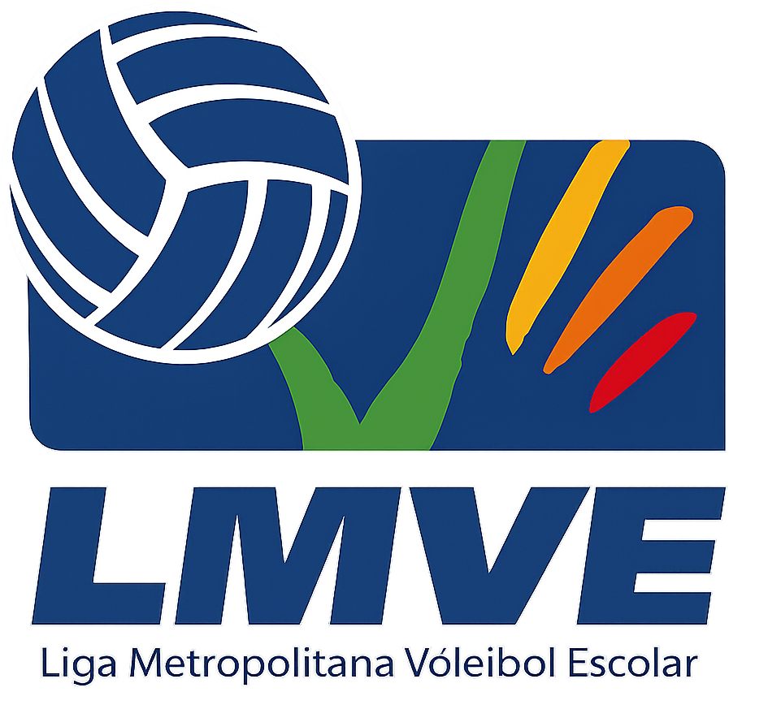

<div align="center">
  <br><br>

  # LMVEweb

  Sitio web oficial de la **Liga Metropolitana de Voleibol Escolar** — historia, multimedia y captación de auspicios.

  [](https://github.com/maumontenegro99/LMVEweb/actions/workflows/ci.yml)
  
  
  
</div>

---

## 📋 Sobre el proyecto

Sitio institucional de la LMVE, fundada en 1987. Cinco vistas públicas (Inicio, Historia, Sobre la LMVE, Multimedia, Contacto) más una página de material de auspicio (`/impacto/`) pensada para enviar por link directo, fuera del menú principal.

El formulario de Contacto guarda cada propuesta de patrocinio en base de datos **y** avisa por correo, con límite de envíos por IP para evitar spam.

| Vista | Ruta | Descripción |
|---|---|---|
| Inicio | `/` | Hero, cifras, redes sociales, colegios participantes |
| Historia | `/historia/` | Línea de tiempo por épocas, desde 1987 |
| Sobre la LMVE | `/sobre/` | Visión y misión |
| Multimedia | `/multimedia/` | Galería de fotos con lightbox |
| Contacto | `/contacto/` | Formulario de auspicio → guarda en BD + envía correo |
| Impacto | `/impacto/` | Material de auspicio para compartir por link directo |

---

## 🛠️ Stack técnico

- **Backend:** Django 6.0.5
- **Estáticos:** WhiteNoise (con hash de contenido para cache-busting)
- **Base de datos:** SQLite en desarrollo · PostgreSQL en producción
- **Seguridad:** Content-Security-Policy con nonces, HSTS, rate limiting (`django-ratelimit`)
- **Correo:** SMTP (Gmail + contraseña de aplicación), con fallback a consola en local
- **Monitoreo:** Sentry (opcional, activa solo con `SENTRY_DSN`)
- **Despliegue objetivo:** Render + PostgreSQL administrado

---

## 🚀 Cómo correrlo en local

```bash
git clone https://github.com/maumontenegro99/LMVEweb.git
cd LMVEweb

python -m venv venv
venv\Scripts\Activate.ps1        # Windows (PowerShell)
# source venv/bin/activate       # macOS / Linux

pip install -r requirements.txt

copy .env.example .env           # Windows
# cp .env.example .env           # macOS / Linux

python manage.py migrate
python manage.py createcachetable   # tabla de cache para el rate limiting
python manage.py runserver
```

Abrir **http://127.0.0.1:8000/**. Con el `.env` recién copiado (`DJANGO_DEBUG=True`), no hace falta configurar nada más para desarrollar — el correo del formulario de Contacto se imprime en la terminal en vez de enviarse de verdad.

### Correr los tests

```bash
python manage.py test
```

<details>
<summary><strong>Variables de entorno</strong> (ver <code>.env.example</code> para la lista completa)</summary>

| Variable | Para qué sirve | Obligatoria |
|---|---|---|
| `DJANGO_DEBUG` | `True` en local, `False` (o vacío) en producción | No — default `False` |
| `DJANGO_SECRET_KEY` | Clave de firma de Django | Sí, si `DJANGO_DEBUG=False` |
| `DJANGO_ALLOWED_HOSTS` | Dominios permitidos, separados por coma | Sí, en producción |
| `DJANGO_ADMIN_URL` | Ruta del panel de admin (default `admin/`) | No |
| `DATABASE_URL` | Postgres en producción; sin definir usa SQLite local | No |
| `EMAIL_HOST_USER` / `EMAIL_HOST_PASSWORD` | Gmail + contraseña de aplicación | No — sin esto, el correo solo se imprime en consola |
| `CONTACTO_DESTINATARIO` | A qué correo llega cada propuesta de auspicio | No |
| `SENTRY_DSN` | Activa el monitoreo de errores | No |

</details>

---

## 📦 Despliegue

El plan completo de despliegue (Render + PostgreSQL + dominio `.cl`) vive en dos documentos, según la audiencia:

- 📘 [`DEPLOY_PLAN_TECHNICAL.md`](./DEPLOY_PLAN_TECHNICAL.md) — versión técnica, paso a paso
- 📗 [`DEPLOY_PLAN_PARA_DIRIGENTES.md`](./DEPLOY_PLAN_PARA_DIRIGENTES.md) — versión en lenguaje simple para la Junta Directiva, con costos y cronograma

El build en Render corre `build.sh` (instala dependencias + `collectstatic`); el `Procfile` aplica migraciones y levanta Gunicorn.

---

## 🌱 Ramas

- **`master`** — versión estable / lo que está (o va a estar) en producción
- **`development`** — trabajo activo; se mergea a `master` cuando algo está listo

---

## 🤝 Organización del proyecto

Este repositorio va a pasar a una **cuenta de organización de la LMVE** (no personal) — ver el detalle en `DEPLOY_PLAN_PARA_DIRIGENTES.md`, sección *"¿De quién es el sitio?"*. El objetivo es que el proyecto no dependa de una sola persona una vez terminado el período de soporte.

<div align="center">
  <sub>Liga Metropolitana de Voleibol Escolar · Fundada en 1987 · "Educar a Través del Deporte"</sub>
</div>
